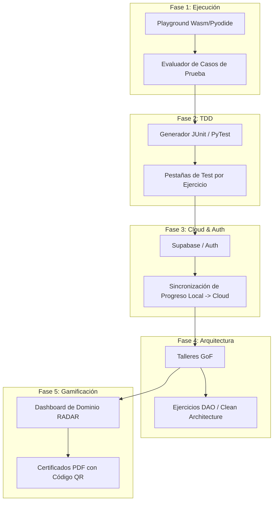

# 🛠️ Guía y Plan de Implementación — Café & Código

Este documento especifica la **arquitectura técnica, convenciones y hoja de ruta de implementación** para continuar expandiendo la plataforma educativa **Café & Código (Aprende)**.

---

## 📐 1. Visión General de Arquitectura

Café & Código está construida con un stack estático e interactivo altamente optimizado para máxima velocidad de carga y excelente estética Neobrutalista:

* **Framework Core:** [Astro](https://astro.build/) (Static Site Generation + Server-Island Rendering).
* **UI Components:** React (para widgets interactivos, temporizadores y modales complejos) + Astro Components.
* **Diagramación UML:** Renderizador nativo HTML/SVG/Canvas con soporte para notación Clásica y Alternativa.
* **Estilos:** Vanilla CSS con variables de diseño Neobrutalista (`--bg-primary`, `--border-color`, sombras duras `#1E1210`).
* **Persistencia Actual:** LocalStorage sin dependencias externas (`aprende_poo_completed_challenges_v1`).

---

## 🗺️ 2. Hoja de Ruta de Implementación (Plan de 5 Fases)



---

### 🟢 Fase 1: Evaluador de Código en Vivo (Playground & Runner)
**Objetivo:** Permitir a los estudiantes ejecutar y validar código directamente en el navegador.

#### Tareas Técnicas:
1. **Python en Browser:** Incorporar `Pyodide` (WebAssembly) en la vista de ejercicios para compilar y ejecutar código Python localmente con $0$ latencia de servidor.
2. **Evaluador Multilenguaje:** Integrar un webhook ligero a una API de ejecución (Judge0 API / Docker microservices) para probar código en **Java, C#, C++ y PHP**.
3. **UI Code Editor:** Reemplazar las áreas de texto con un editor de código embebido (CodeMirror / Monaco Editor) con resaltado sintáctico y autocompletado básico.

---

### 🟡 Fase 2: Metodología TDD & Suites de Pruebas Unitarias
**Objetivo:** Introducir la cultura de pruebas unitarias profesionales (Test-Driven Development).

#### Tareas Técnicas:
1. **Generación Dinámica de Tests:** Extender `src/lib/pooCodeGenerators.ts` con la función `generateUnitTestCode(ch, lang)`.
2. **Frameworks de Prueba:**
   - ☕ **Java:** Suite `JUnit 5` (`@Test`, `assertEquals`, `assertNotNull`).
   - 🐍 **Python:** Suite `unittest` / `pytest`.
   - 🎮 **C#:** Suite `NUnit` (`[Test]`, `Assert.AreEqual`).
   - ⚙️ **C++:** Suite `GoogleTest` (`TEST()`, `EXPECT_EQ`).
3. **Pestaña UI:** Añadir la pestaña `🧪 Pruebas Unitarias` en la barra de pestañas multilenguaje dentro de cada desafío.

---

### 🔵 Fase 3: Autenticación de Usuarios y Persistencia Cloud
**Objetivo:** Permitir el inicio de sesión y sincronización entre dispositivos.

#### Tareas Técnicas:
1. **Base de Datos & Auth:** Configurar Supabase Auth (OAuth con GitHub / Google / Correo).
2. **Capas de Persistencia Dual (`src/lib/storage.ts`):**
   - Si el usuario está offline o anónimo: Operar contra `localStorage`.
   - Si el usuario inicia sesión: Sincronizar automáticamente el historial local hacia la base de datos `user_progress`.
3. **Vista de Perfil (`src/pages/cuenta/index.astro`):** Mostrar fecha de registro, estadísticas globales, streak de días seguidos programando y configuración de notación UML preferida.

---

### 🟣 Fase 4: Nuevos Talleres de Patrones de Diseño GoF y Arquitectura
**Objetivo:** Ampliar la cobertura de cursos hacia la ingeniería de software avanzada.

#### Tareas Técnicas:
1. **Taller de Patrones Creacionales, Estructurales y de Comportamiento:**
   - Crear `/challenges/design-patterns` con 20 desafíos dedicados (Factory Method, Singleton, Builder, Adapter, Decorator, Observer, Strategy, State).
   - Diseñar diagramas de clases UML específicos en `designPatterns.ts`.
2. **Taller de Patrones de Arquitectura:**
   - Ejercicios interactivos de **DAO (Data Access Object)**, **Repository** y **Patrón MVC**.

---

### 🔴 Fase 5: Gamificación, Dashboard de Maestría y Certificados PDF
**Objetivo:** Incrementar la retención y certificar el conocimiento adquirido.

#### Tareas Técnicas:
1. **Dashboard Radar en `/panel`:**
   - Implementar un gráfico de radar en Chart.js / SVG que represente el nivel de maestría del usuario en los 5 pilares:
     `[Abstracción, Encapsulamiento, Herencia, Polimorfismo, Composición / Interfaces]`.
2. **Generador de Certificados PDF:**
   - Al completar el 100% de los 20 desafíos de una categoría (ej: POO Completa), habilitar el botón **«Descargar Certificado Oficial»**.
   - Generación dinámica con `jspdf` e inclusión de **Código QR de Validación**.

---

## 🛠️ 3. Estructura de Archivos Clave del Proyecto

```
aprende/
├── src/
│   ├── components/
│   │   ├── challenges/
│   │   │   ├── MermaidDiagram.astro    # Motor de renderizado UML de 3 niveles
│   │   │   └── UmlClassDiagram.astro   # Componente de diagramación básica
│   │   └── ChallengeTimerWidget.tsx    # Reloj flotante interactivo (Drag & Drop)
│   ├── data/
│   │   └── pooCompletedChallenges.ts   # Definición de los 20 desafíos completos
│   ├── lib/
│   │   └── pooCodeGenerators.ts        # Generador de código Java, Python, C#, C++
│   ├── pages/
│   │   ├── challenges/
│   │   │   ├── poo/                    # POO Básico (10 clases)
│   │   │   ├── inheritance/            # Herencia y Polimorfismo (20 desafíos)
│   │   │   ├── interface/              # Interfaces y Contratos (20 desafíos)
│   │   │   └── oop-completed/          # POO Completa (1 Padre + 3 Hijas + Interfaz + Composición)
│   │   └── course/
│   │       └── java/poo-completed/     # Módulo teórico con soluciones desglosadas
│   └── styles/
└── README_IMPLEMENTACION.md            # Guía técnica de desarrollo
```

---

## 💻 4. Comandos de Desarrollo y Verificación

```bash
# Instalar dependencias
npm install

# Iniciar servidor de desarrollo local
npm run dev

# Ejecutar verificación de build y sintaxis
npm run build

# Previsualizar el bundle de producción
npm run preview
```

---

<div align="center">
  <sub>Documentación oficial de arquitectura de la plataforma <strong>Café & Código</strong></sub>
</div>
