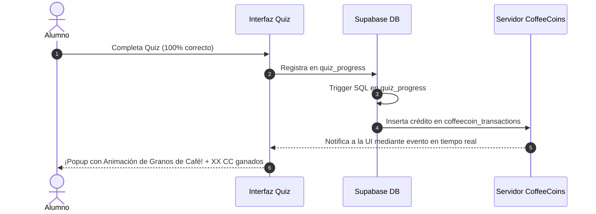

# Análisis del Proyecto: Café y Código ☕✨

¡Hola! Tras realizar una exploración profunda y minuciosa de la arquitectura, base de datos y diseño del proyecto **Café y Código**, he elaborado un diagnóstico independiente. He evitado analizar el `README.md` para mantener una visión fresca y objetiva basada puramente en el código real (`.astro`, `.tsx`, `.sql`, rutas y componentes).

A continuación, presento un desglose completo de lo que hace a este proyecto excepcional, los puntos de dolor técnico y las oportunidades de mejora que lo llevarían a un estándar de excelencia y alta fidelización.

---

## 🌟 La Esencia de "Café y Código": Lo que Funciona Espectacularmente

El proyecto no es simplemente una plataforma educativa de software; es una **experiencia de marca editorial, cálida y de ritmo pausado**. Visualmente y a nivel de UX, tiene decisiones soberbias:

1. **Dirección Artística Consistente**: La paleta cálida (tonos crema `#FBF6EE`, café `#2B1D1B` y acentos tierra) rompe por completo con el frío minimalismo tecnológico de otras plataformas. Las tipografías (`Cinzel`, `Quicksand`) le dan una vibra de libro antiguo y café de especialidad.
2. **Personalización Temática por Curso**: El uso de skins o skins visuales por lección según el curso (como la estética egipcia texturizada para el curso de **Arquitectura 4+1**, o el look azul y amarillo característico de **Python**) es un detalle premium que demuestra un cariño inmenso en el front-end.
3. **El Ritmo Tranquilo**: El **Simulador de Café** de la página principal (`/cafe-del-dia/`) introduce al usuario en un "ritual" antes de programar, lo que genera una conexión emocional única y fomenta el hábito saludable.

---

## 🔍 Diagnóstico Técnico: ¿Qué le Falta al Proyecto?

A pesar de su excelente UI/UX, existen varias **inconsistencias estructurales, lógicas simuladas y redundancias de código** que limitan el potencial del proyecto a largo plazo. Aquí detallo los cinco ejes principales de mejora:

### 1. La Paradoja de la Economía "CoffeeCoin" (Virtual vs. Real)
Actualmente, el sistema de **CoffeeCoins (CC)** es puramente estético y local. 
* **El Problema**: Las transacciones en el panel (`CoffeeCoinStoreSection.tsx`) son un arreglo estático en código (`MOCK_COFFEECOIN_TRANSACTIONS`), y la tienda de canjes tiene todos sus botones deshabilitados con la etiqueta *"No disponible aún"*.
* **Lo que Falta**: 
  - **Persistencia en la Base de Datos**: Crear una tabla `public.coffeecoin_transactions` en Supabase que registre cada crédito y débito asociado al `user_id`.
  - **Automatización del Flujo de Ganancia**: Programar triggers en SQL o servicios de API para que, cuando un alumno complete con éxito un Quiz (`quiz_progress` se actualiza), o prepare su café diario en la base de datos (`coffee_history`), se le otorguen CoffeeCoins reales en su cuenta de manera automática.
  - **Canjes Funcionales**: Desarrollar el backend para habilitar la compra de elementos estéticos (como el "Tema visual extra" o "Badge en perfil") consumiendo sus CC.

---

### 2. Explosión Redundante de Componentes de Quiz (Deuda Técnica)
* **El Problema**: El directorio `src/components/` tiene **más de 25 componentes separados** para modales de quiz (por ejemplo, `PythonQuizModal.astro`, `SqlQuizModal.astro`, `ExcelQuizModal.astro`, `GitQuizModal.astro`, etc.).
* **La Causa**: Cada modal está cableado manualmente para importar su banco de preguntas específico, renderizar sus estilos y registrar en la base de datos. Cada archivo repite casi **400 líneas de código HTML, CSS y JavaScript inline**, lo que representa una deuda técnica y de mantenimiento masiva.
* **La Solución**: Fusionar todo en un único componente genérico y reutilizable: `QuizModal.astro`. Este recibiría como props el `courseSlug`, `quizKey`, el color temático principal y el ícono de branding. Las preguntas se cargarían de manera dinámica mediante un registro o importación perezosa (lazy mapping).

---

### 3. Rutas de Aprendizaje Huérfanas (Roadmaps Visuales)
La propuesta de valor en la página de aterrizaje (Landing) promete al alumno: *"Elegís una ruta: Lógica, Python, Web... la que más te interese"*.
* **El Problema**: Cuando el usuario entra al catálogo de cursos (`/cursos/`), se encuentra con una cuadrícula/lista plana de 29 cursos filtrable por tags, pero **sin ninguna guía visual de orden o prerrequisito**. Un principiante no sabe si debe estudiar *Patrones de Diseño* antes de *C#*, o *Modelamiento de Datos* antes de *Consultas SQL*.
* **Lo que Falta**: Implementar una sección de **"Rutas de Aprendizaje Recomendadas"** diseñada de forma interactiva y visual (similar a un mapa de metro o un menú de cafetería por pasos):
  - *Ruta Fundamentos*: PSeInt ➔ Ecosistemas Pro ➔ Terminal Unix ➔ Git.
  - *Ruta Backend Python*: Python ➔ Consultas SQL ➔ Testing con Python ➔ Modelo C4.
  - *Ruta Frontend*: HTML5 ➔ CSS3 ➔ JavaScript.

---

### 4. Insignias Estáticas sin Notificación Inmediata
Aunque existe un sistema incremental de insignias (`badge_system.sql` y `UserBadgesCard.tsx`), su experiencia de usuario es pasiva.
* **El Problema**: El alumno tiene que ir manualmente a su panel y hacer clic en **"Verificar progreso"** para que el frontend invoque la RPC de base de datos `check_and_award_badges`.
* **Lo que Falta**: 
  - **Notificaciones Inmediatas**: Cuando un usuario finaliza una lección que completa los requisitos de una insignia, se debe gatillar una animación visual en pantalla completa (usando partículas y confeti premium) que le otorgue la insignia al instante.
  - **Diseños Dinámicos en SVG**: Las insignias podrían ser renderizadas dinámicamente en formato SVG en base a su temática, usando el generador de SVG del proyecto (`badgeDesignerSvg.ts`).

---

### 5. Falta de un Editor de Código Interactivo Integrado (Playground)
La plataforma enseña múltiples lenguajes de programación (Python, C++, JS, Ruby, PL/SQL), pero la interacción se limita a leer explicaciones y resolver quizzes de opción múltiple.
* **El Problema**: El alumno debe salir de la web, abrir su editor local o usar herramientas externas para probar el código. Aunque el archivo `package.json` incluye `@codesandbox/sandpack-react` y `monaco-editor`, su integración en las lecciones es tímida o nula.
* **Lo que Falta**: Un **Playground interactivo de consola** en las lecciones de lógica y lenguajes. El alumno debería poder escribir código directamente al lado de la lección y presionar un botón de "Ejecutar" de estética neobrutalista para ver los resultados en tiempo real.

---

## 🛠️ Plan de Acción Propuesto

Si estuviéramos listos para implementar mejoras, este sería el orden lógico de ejecución para garantizar estabilidad y máximo impacto:

| Fase | Componente / Área | Descripción Técnica |
| :--- | :--- | :--- |
| **Fase 1** | Refactorización de Componentes | Crear `QuizModal.astro` unificado, migrar los 25 modals de quiz y borrar los archivos obsoletos para sanear el repositorio. |
| **Fase 2** | Persistencia de CoffeeCoins | Crear tabla de transacciones en Supabase, registrar RPCs/triggers de ganancia por completar quizzes/cafés y habilitar el componente en el Panel. |
| **Fase 3** | Tienda de Canjes Real | Desarrollar la lógica de débito y desbloqueo de ítems estéticos o funciones (como descarga de PDF) usando Supabase. |
| **Fase 4** | Roadmaps Visuales | Diseñar la interfaz interactiva de Rutas de Aprendizaje en la sección `/cursos/`. |
| **Fase 5** | Notificación de Logros | Implementar un sistema de overlays animados en tiempo real al ganar badges o subir de nivel cafetero. |

---

> [!TIP]
> **Pregunta de Diseño Clave para el Usuario:**  
> ¿Qué te parece priorizar la **Fase 1 (Refactorizar los Quizzes)** para limpiar el código repetitivo, o prefieres que iniciemos directamente con la **Fase 2 (Hacer real el monedero y la tienda de CoffeeCoins en Supabase)**?

