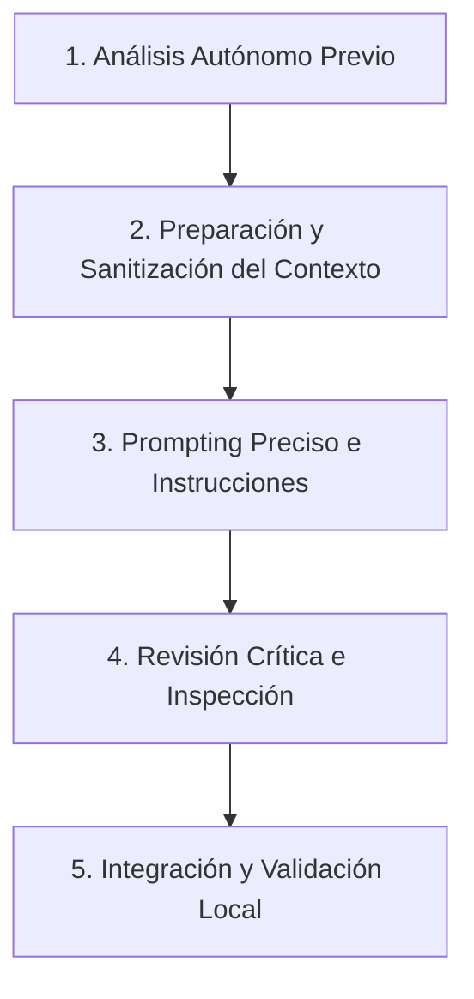

# Guía de Desarrollo Ético y Responsable con Inteligencia Artificial

Esta propuesta y guía de trabajo está diseñada para establecer un marco de referencia ético, seguro y eficiente al utilizar herramientas de Inteligencia Artificial (tales como GitHub Copilot, Cursor, OpenAI Codex, OpenCode, Antigravity, Claude, entre otros) en el desarrollo de software.

El objetivo es potenciar la productividad del equipo sin comprometer el aprendizaje, el pensamiento lógico, la seguridad de la información, ni incurrir en un consumo irresponsable de recursos de computación (tokens).

---

## 1. El Principio de No Dependencia de la IA

> [!IMPORTANT]
> **Fundamentación:**
> El uso ético de la IA no debe reemplazar tus procesos de razonamiento ni el aprendizaje que debes lograr. La dependencia excesiva limita el desarrollo del pensamiento lógico, la comprensión de las estructuras de datos y la capacidad de detectar errores o vulnerabilidades. 
> 
> En etapas iniciales de la programación o al abordar nuevos paradigmas, la IA debe cumplir un **rol de apoyo**, no de sustitución del análisis ni de la creación autónoma del código.

### Diagnóstico de Dependencia vs. Uso Responsable

| Comportamiento de Dependencia (Alerta ⚠️) | Comportamiento Responsable (Objetivo ✅) |
| :--- | :--- |
| Aceptar sugerencias de autocompletado sin poder explicar el código. | Modificar, ampliar y depurar el código de forma completamente autónoma (sin usar la IA). |
| No saber justificar decisiones de diseño (ej. elegir una lista frente a un diccionario o set). | Explicar detalladamente el funcionamiento y la justificación de cada bloque de código. |
| Desconocer cómo funciona el control de excepciones (`try/except`) sugerido por la IA. | Detectar e identificar errores de sintaxis y lógicos simples sin apoyo de la IA. |
| Ignorar los riesgos de seguridad o validaciones que previene el código insertado. | Comprender y explicar los riesgos de seguridad (como inyecciones o desbordamientos) que mitiga cada validación. |

---

## 2. Guía de Seguridad y Privacidad: ¿Qué indicarle a la IA y qué NO?

Las herramientas de IA aprenden de los datos y, a menudo, envían información a servidores externos. Por ello, proteger la propiedad intelectual y los datos sensibles es una prioridad absoluta.

### 🚫 Lo que NUNCA debes indicarle o enviar a la IA:
*   **Credenciales y Secretos:** Claves de API (`API_KEY`), tokens de autenticación, contraseñas, certificados SSL o credenciales de bases de datos.
*   **Datos de Carácter Personal (GDPR/PII):** Nombres de clientes, correos electrónicos reales, números de teléfono, identificaciones o datos financieros.
*   **Código Propietario Confidencial:** Código que contenga algoritmos de negocio core protegidos por contratos de confidencialidad (NDA), a menos que estés usando entornos corporativos con garantías explícitas de privacidad de datos.
*   **Bases de Datos Reales:** Dump de bases de datos de producción o registros reales del sistema.

###  Lo que SÍ puedes indicarle o enviar a la IA:
*   **Estructuras de Datos y Firmas de Métodos:** Declaraciones de funciones, clases, interfaces, tipos de TypeScript u objetos vacíos para guiar el autocompletado.
*   **Pseudocódigo y Lógica Algorítmica General:** Lógicas abstractas (ej. *"¿Cómo ordenar una lista de objetos por una propiedad de fecha en JS?"*).
*   **Datos Dummy o Mockeados:** Datos de prueba generados sintéticamente (ej. `[{ id: 1, name: "User A", email: "user@example.com" }]`).
*   **Mensajes de Error y Stack Traces Sanitizados:** Mensajes de error del compilador, omitiendo rutas locales absolutas que revelen nombres de usuarios del sistema o nombres de proyectos confidenciales.

---

## 3. Guía Paso a Paso para Trabajar con Cualquier IA (Modo Desarrollador)

Para maximizar la eficiencia y evitar la fatiga mental o el sobrecosto de tokens, sigue este flujo de trabajo estructurado al interactuar con cualquier asistente:

### Paso 1: Análisis Autónomo Previo (Antes del Chat)
*   **Objetivo:** Comprender el problema por tu cuenta antes de delegarlo.
*   **Acción:** Define la lógica, el flujo del programa y dibuja o escribe en borrador la solución mentalmente. Si no sabes lo que quieres lograr, la IA te entregará respuestas genéricas que te desviarán del objetivo.

### Paso 2: Preparación y Sanitización del Contexto (Ahorro de Tokens)
*   **Objetivo:** Reducir la cantidad de información enviada para no saturar la ventana de contexto de la IA y optimizar el consumo.
*   **Acción:** 
    *   No selecciones carpetas enteras de código si solo necesitas trabajar en una sola función de un archivo.
    *   Usa referencias directas al archivo actual (por ejemplo, usando `@` o comandos de selección de archivos en Cursor o Antigravity).
    *   Limpia el código de comentarios innecesarios o secciones irrelevantes antes de enviarlo.

### Paso 3: Prompting Preciso e Instrucción de Rol
*   **Objetivo:** Obtener respuestas óptimas al primer intento.
*   **Acción:** Define claramente la tarea. Proporciona:
    1. **Rol:** *"Actúa como un desarrollador experto en Astro y TypeScript..."*
    2. **Entrada:** Las firmas de las funciones o interfaces relevantes.
    3. **Salida esperada:** Solicita explicaciones breves y código modular. Limita la respuesta pidiendo: *"Solo genera el cuerpo de la función X, evita explicaciones redundantes"*.

### Paso 4: Revisión Crítica (Checklist de Validación Obligatoria)
Antes de incorporar o aceptar el código generado por la IA, hazte las siguientes preguntas:

*   **¿Copia o procesa datos sin validar?** (¿Verifica tipos de datos, valores nulos o límites?).
*   **¿Modifica la estructura de datos original?** (Evita efectos secundarios indeseados o mutación de props y estados directamente en frameworks reactivos).
*   **¿Maneja excepciones específicas?** (¿Tiene bloques `try/catch` para fallos de red o base de datos en lugar de ignorar el error?).
*   **¿Complejidad clara y razonable?** (¿Es la solución óptima en términos de rendimiento $O(N)$ o introduce bucles innecesarios?).

### Paso 5: Integración y Validación Local
*   **Objetivo:** Asegurar que el código funciona en el contexto real de la aplicación.
*   **Acción:** Copia el código sugerido manualmente o edítalo de forma guiada, asegurándote de adaptar los nombres de las variables al estilo del proyecto. Corre los tests unitarios locales y haz pruebas manuales sin depender de que la IA te diga si está bien.

---

## 4. Gestión Consciente de Contexto y Optimización de Tokens

El abuso de la ventana de contexto (enviar megabytes de código de forma innecesaria) provoca:
1.  **Lentitud en la respuesta:** La IA tarda más en procesar y responder.
2.  **Degradación de la calidad:** A mayor contexto irrelevante, mayor es la probabilidad de que la IA "alucine" o ignore instrucciones importantes.
3.  **Costos elevados:** El consumo inútil de tokens encarece el uso de las APIs.

### Buenas Prácticas para el Consumo Eficiente de Tokens:

*   **Usa selectores de contexto selectivos:** En herramientas como Cursor o Antigravity, no añadas todo el codebase en la ventana de chat. Agrega únicamente el archivo que estás editando y su respectiva interfaz o tipo de datos.
*   **Reinicia el Chat con Frecuencia:** Cuando cambies de tarea o resuelvas un error, abre un nuevo chat. Mantener una conversación larga acumula tokens de historial que se reenvían en cada pregunta, desperdiciando recursos y confundiendo al modelo.
*   **Especifica el formato de salida:** Si solo necesitas una línea de código o una corrección rápida, indícale: *"Muestra únicamente la línea corregida"* para ahorrar tokens de generación (de salida).

---

## 5. Reflexión Ética: Responsabilidad Profesional

> [!WARNING]
> En la programación segura y profesional, **la responsabilidad sobre el código siempre recae en la persona que lo desarrolla**, no en la IA que lo sugirió.
> 
> Utilizar inteligencia artificial de forma ética implica comprender el código generado, proteger la propiedad intelectual y los datos del proyecto, y mantener un rol activo y autónomo en el proceso de desarrollo. El correcto funcionamiento visual o funcional de un script no garantiza que sea seguro, eficiente o mantenible a largo plazo.

### Preguntas de Reflexión y Autoevaluación

#### 1. ¿Cuál es el principal riesgo de aceptar código de Copilot (o cualquier otra IA) sin comprenderlo?
*   **Respuesta:** El principal riesgo es la introducción involuntaria de vulnerabilidades de seguridad (como fugas de memoria, inyecciones de código, validaciones omitidas), bugs silenciosos de rendimiento (complejidad temporal excesiva) o código innecesariamente complejo que complique el mantenimiento futuro de la base de código. Asimismo, atrofia la capacidad del desarrollador para resolver problemas por sí mismo.

#### 2. Menciona dos acciones concretas para proteger datos al programar con IA.
*   **Respuesta:**
    1. **Sanitización de Prompts:** Reemplazar nombres de variables, API keys, credenciales y datos reales del usuario por variables de entorno de ejemplo y datos ficticios antes de subirlos a la herramienta.
    2. **Configuraciones de Privacidad:** Desactivar la telemetría y el entrenamiento de modelos públicos en las configuraciones del IDE o del plugin de IA utilizado.

#### 3. ¿Cómo asegurar transparencia y no dependencia en tu informe o documentación?
*   **Respuesta:** Declarar formalmente qué módulos o tareas fueron desarrollados con apoyo de IA y cómo se validó dicho código. Además, documentar la justificación técnica de la solución elegida (por qué se usó esa estructura, qué complejidad tiene, qué excepciones se controlan) demostrando control absoluto sobre el código entregado.
